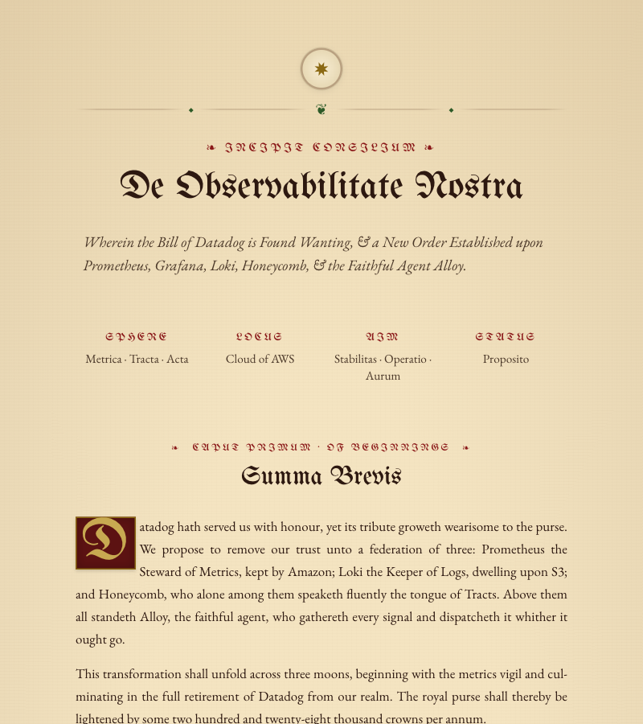

# Ye Olde RFC

**Request for Counsel** — transform dry technical specs into medieval manuscripts, complete with blackletter fonts, illuminated drop caps, and mock-archaic English prose.

Feed it a Request for Counsel, get back a scroll.



## How it works

1. **Claude** rewrites your technical document in mock-medieval English with Latin titles, personified services ("Prometheus the Steward of Metrics"), and archaic metaphors — while preserving every technical detail
2. **Jinja2** renders the structured output into an HTML template styled with UnifrakturMaguntia blackletter, EB Garamond body text, parchment backgrounds, and illuminated drop caps

## Quick start

```bash
# Install
uv sync

# Generate from a real RFC (needs ANTHROPIC_API_KEY)
export ANTHROPIC_API_KEY=sk-ant-...
uv run python olde_rfc.py your-rfc.md -o scroll.html

# Test the template without an API call
uv run python olde_rfc.py --mock -o scroll.html

# Open it
open scroll.html
```

## Usage

```bash
# Basic: RFC in, scroll out
uv run python olde_rfc.py rfc.md -o scroll.html

# PDF output (requires weasyprint)
uv run python olde_rfc.py rfc.md -o scroll.pdf

# Pipe from stdin
cat rfc.md | uv run python olde_rfc.py -o scroll.html

# Inspect the structured JSON from the LLM
uv run python olde_rfc.py rfc.md --json-output

# Re-render from saved JSON (skip the API call)
uv run python olde_rfc.py --json-input saved.json -o scroll.html

# Use a different model
uv run python olde_rfc.py rfc.md --model claude-opus-4-6 -o scroll.html
```

## Requirements

- Python 3.11+
- [uv](https://docs.astral.sh/uv/)
- An [Anthropic API key](https://console.anthropic.com/)
- Optional: `weasyprint` for PDF output (`uv pip install weasyprint`)

## What it does to your text

| Your RFC says | The scroll says |
|---|---|
| costs | tribute, tithe, the royal purse |
| servers | keeps, strongholds, towers |
| databases | great vaults, scriptoria |
| monitoring | the vigil, watchkeeping |
| deployment | summoning, mustering |
| CI/CD | the Rite of Continuous Summoning |
| load balancer | the Gate Keeper |
| authentication | proving one's heraldry |
| bugs | gremlins, foul spirits |

Product names and acronyms (AWS, S3, gRPC, Kubernetes) are kept intact.

## License

MIT
